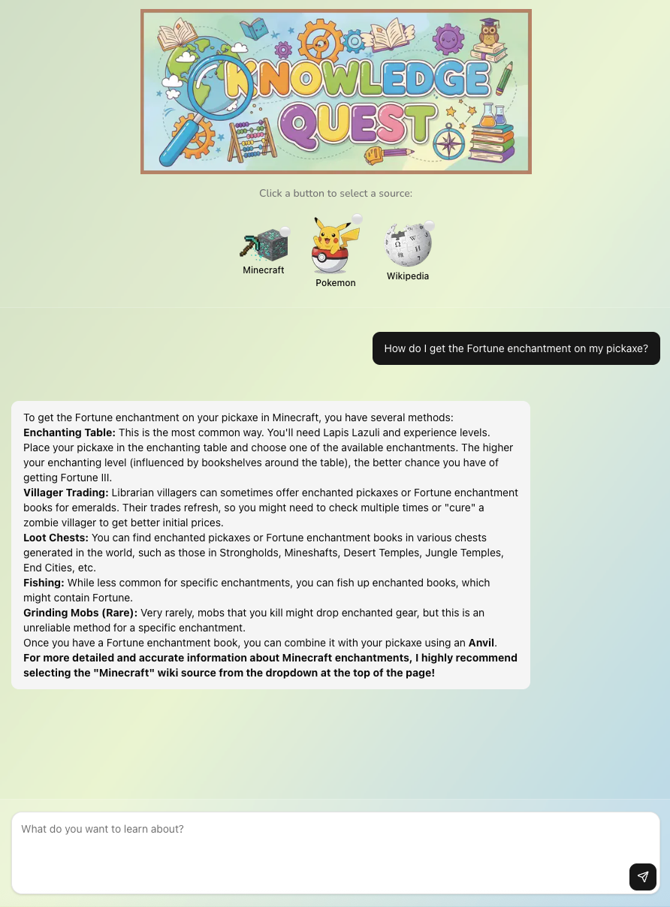

# Knowledge Quest

A family-friendly wiki helper that lets kids explore Minecraft, Pokémon, and general knowledge without ads or tracking. The app runs locally on your computer, uses Google Gemini 2.5 Flash for natural-language chat, and spins up dedicated Model Context Protocol (MCP) servers to fetch accurate information straight from curated wikis.

This README is aimed at tech-savvy parents who want to host a safe research companion at home while keeping full control over the data flow.

[](public/screenshot.png)

---

## Why You Might Like This
- **Kid-first browsing** – questions are answered with age-appropriate language and clear citations instead of search-engine rabbit holes.
- **Three instant knowledge modes** – switch between Minecraft Wiki, Bulbapedia (Pokémon), and Wikipedia with image buttons.
- **No mystery cloud services** – everything runs on your machine; stop the app and all MCP processes shut down.
- **Built to extend** – add new wikis or swap AI models as your family’s interests change.

---

## Using the App with Your Kids
1. Click one of the three image buttons to select a wiki source (Minecraft, Pokémon, or Wikipedia).
2. Ask a question in the chat box. The app starts the appropriate MCP server if it isn’t already running.
3. Responses include wiki-backed facts when available; if the wrong source is active, the assistant politely reminds you to switch.
4. Change sources at any time—the previous MCP server is stopped automatically.

**Tip:** The footer shows the current AI model. Future updates will let you switch between models without editing code.

---

## Prerequisites
- **Node.js 20+** (for the Next.js front end). Installing via [volta](https://volta.sh) or [nvm](https://github.com/nvm-sh/nvm) keeps things tidy.
- **pnpm** package manager: `npm install -g pnpm`.
- **Python 3.11+** (already vendored in `mcp-servers/wikipedia/venv`, but you can recreate it if you prefer).
- **Google Gemini API key** – create one in the [Google AI Studio](https://aistudio.google.com/) dashboard.

Optional (for future extensions): Docker, git, and familiarity with MCP protocols.

---

## Getting Started

1. **Install dependencies**
   ```bash
   pnpm install
   ```

2. **Provide your Gemini key**
   ```bash
   cp .env.local.example .env.local  # if the example file exists
   # or create/edit .env.local manually
   echo "GOOGLE_GENERATIVE_AI_API_KEY=your-real-key" >> .env.local
   ```

3. **Verify MCP binaries**
   - Minecraft MCP is bundled under `mcp-servers/minecraft`.
   - Pokémon MCP uses the MediaWiki MCP npm package (`mcp-servers/pokemon`).
   - Wikipedia MCP lives in `mcp-servers/wikipedia/venv`. If you’d like a fresh install:
     ```bash
     python3 -m venv mcp-servers/wikipedia/venv
     source mcp-servers/wikipedia/venv/bin/activate
     pip install wikipedia-mcp fastmcp
     deactivate
     ```

4. **Start the app**
   ```bash
   pnpm dev
   ```

5. **Open the interface**
   Navigate to [http://localhost:3000](http://localhost:3000). The chat window and wiki selector buttons appear immediately.

---

## Customization & Advanced Topics

### Changing the AI Provider
- The default model is configured in `app/api/chat/route.ts` via `google('gemini-2.5-flash', ...)`.
- To experiment with OpenAI or other providers, swap in the relevant AI SDK driver and update `.env.local` with the appropriate API key.

### Adding Another Wiki (MediaWiki-based)
1. Duplicate `mcp-servers/pokemon` and update the environment variables to target your new wiki’s API.
2. Register the server in `lib/mcp/manager.ts` and expose it through `components/mcp-selector.tsx` (add your image to the public folder).
3. Update the system prompt logic in `app/api/chat/route.ts` to tailor responses for the new topic.

### Integrating a Custom MCP (TypeScript/Python/Node)
- Follow the structure inside `mcp-servers/minecraft` (TypeScript) or `mcp-servers/wikipedia` (Python) for inspiration.
- Ensure the executable can run via `spawn` with stdio transport.
- After adding the command to `mcp-servers`, register it in the manager and adjust the UI selector accordingly.

---

## Troubleshooting
| Symptom | What to Check |
| --- | --- |
| Gemini complains about missing API key | Confirm `GOOGLE_GENERATIVE_AI_API_KEY` is set in `.env.local` and restart the dev server. |
| “Failed to switch MCP server” error | Inspect terminal logs—most common causes are missing binaries or blocked ports. |
| Wikipedia tool calls fail | Ensure the virtualenv exists and that your machine has outbound HTTPS access. |
| Pokémon data not returning | Run `pnpm install` inside `mcp-servers/pokemon` if the node_modules folder is missing. |

---

## Roadmap (Parent-Facing)
- Splash graphics and animations when switching MCP servers.
- Option to choose the underlying AI model directly from the interface.
- MCP-specific "thinking" animations to make waiting more fun.
- Expanded documentation for self-hosting additional MCP servers of any language.

---

## Additonal Highlights
- **Chat UI** built with Next.js 15, Tailwind, and shadcn/ui components.
- **Gemini 2.5 Flash** as the default language model (configurable for other providers).
- **Process manager** that launches the right MCP server for each wiki and restarts them on demand.
- **Context-aware prompts** nudge kids to pick the correct source (e.g., Pokémon questions while Minecraft is active).
- **Markdown responses** render cleanly, including lists, headers, and tables.

---

## Contributing & Feedback
This project is still in its first iteration. Suggestions, bug reports, and family-friendly ideas are welcome—open an issue or send a pull request. If you’re running it with your kids, we’d love to hear what topics they explore next!

---

**Safe browsing, locally powered.**
